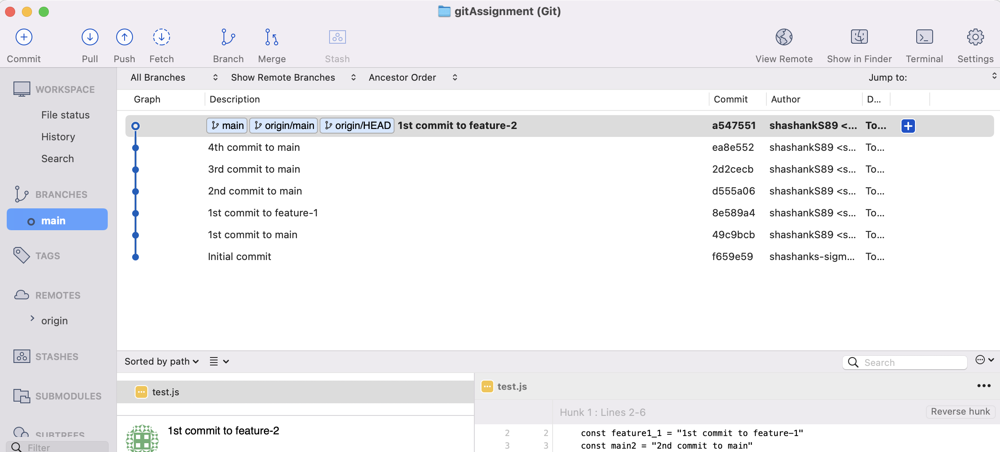

# gitAssignment

1. Create a new repository in GitHub and configure it with sourceTree to see History in graph format.
2. Add a commit to main branch - create a file test.js and add some code and commit to main branch.

   `git add . git commit -m "1st commit to main"git push origin main`
3. Create a feature-1 branch.

   `git checkout -b feature-1`
4. Add a commit to feature-1 - now add some changes in test.js and commit to feature-1 branch.

   `git add . git commit -m "1st commit to feature-1" git push origin feature-1`
5. Add a commit to main branch - switch to main branch, pull all the changes done in feature-1 and then add some changes in test.js and commit to main branch.

   `git checkout main git pull origin feature-1 git add. git commit -m "2nd commit to main" git push origin main`
6. Create a feature-2 branch from main.

   `git branch feature-2`
7. Add a commit to main branch - do some changes in test.js and commit to main branch.

   `git add . git commit -m "3rd commit to main" git push origin main`
8. Merge feature-1 to main.

   `git merge feature-1`
9. Add a commit to main branch - do some changes in test.js and commit to main branch.

   `git add . git commit -m "4th commit to main" git push origin main`
10. Add a commit to feature-2 branch - switch to feature-2 branch, pull all the changes done in main and then add some changes in test.js and commit to feature-2 branch.

    `git checkout feature-2 git pull origin main git add . git commit -m "1st commit to feature-2" git push origin feature-2`
11. Merge feature-2 to main.

    `git checkout main git merge feature-2 git push origin main`
12. Delete feature-1 and feature-2 branches - write below command to delete both branches locally and remotely.

    `git branch -d feature-1 and feature-2 git push origin --delete feature-1 feature-2`
13. PFA history graph in [link](https://github.com/shashanks-sigmoid/gitAssignment/tree/main/image/README).

    
